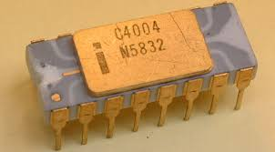
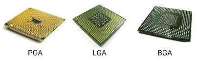
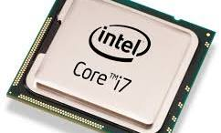
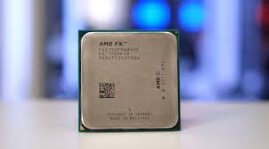

## UT011 – Hardware. Microprocesadores

### 1. FUNCIÓN. EVOLUCIÓN. CARACTERÍSTICAS GENERALES

El microprocesador es el chip más importante de cualquier placa base. Sin él, la computadora no podría funcionar. Este componente electrónico contiene millones de transistores cuya combinación permite realizar el trabajo encomendado al chip. Generalmente son rectangulares y tienen patillas (pins) para colocarlos en la placa base.

También se le conoce como CPU (Central Processor Unit) o Unidad Central de Procesamiento. Se describen en términos de:
- Tamaño de palabra
- Velocidad
- Memoria caché interna
- Capacidad de RAM asociada
- Procesador gráfico integrado (en muchos casos)

---

#### 1.1. Características

**a) Palabra:**
El tamaño de la palabra es el número de bits que se maneja como unidad. Actualmente, todos los procesadores tienen un ancho de palabra de 64 bits, aunque hasta hace poco era de 32 bits.

**b) Velocidad del procesador:**
- **MHz o GHz:** Para microcomputadoras. Se mide por la frecuencia de oscilación del reloj.
- **MIPS:** Millones de instrucciones por segundo. Para estaciones de trabajo, minis y macrocomputadoras.
- **FLOPS:** Operaciones de punto flotante por segundo. Para supercomputadoras.

**c) Memoria caché:**
Memoria intermedia entre el microprocesador y la RAM. Existen tres niveles:
- **L1:** Interna al microprocesador. Ej: 4x32KB de datos e instrucciones.
- **L2:** En el encapsulado de cada núcleo. Ej: 4x256KB.
- **L3:** Compartida entre núcleos. Mayor capacidad, menor velocidad.

---

**d) FSB (Frontal Side Bus):**
Canal de comunicación entre el microprocesador y el resto del sistema. Su velocidad depende de una señal de reloj. Actualmente, con memorias DDR4, alcanza los 4200 MHz.

**e) Juego de instrucciones:**
Conjuntos como MMX, SSE, 3DNow mejoran el rendimiento en aplicaciones multimedia, gráficos 3D, audio y vídeo.

**f) Tecnología de fabricación:**
Indica la distancia entre transistores. A menor tamaño, mayor integración. Ej: Intel (14nm, 10nm), AMD (7nm). Permite más transistores y menor consumo.

**g) Hyper Threading:**
Tecnología de Intel que permite que un procesador físico se comporte como dos lógicos, mejorando la ejecución concurrente.

--- 

**h) Overclocking:**
Consiste en aumentar la velocidad de funcionamiento del procesador más allá de su diseño original. Riesgos:
- Aumento del calor
- Electromigración
- Alteración de la configuración global
- Pérdida de garantía

**i) Multiproceso:**
Uso de más de un microprocesador en un sistema. Requiere:
- Placa base con soporte multiproceso
- Microprocesadores compatibles

**Nota:** No confundir con multitarea.

---

### 2. ARQUITECTURA. MICROS COMERCIALES

#### 2.1. Arquitectura

Un procesador se compone de:
- Memoria
- ALU (Unidad Aritmético-Lógica)
- CU (Unidad de Control)
- Bus interno
- Conexiones externas

Basado en la arquitectura de Von Neumann. Evolución:
- Intel 8086 (1979): 29.000 transistores, 14 MHz
- Pentium III (1999): 8.200.000 transistores, 2 GHz
- Procesadores actuales: más de 4 billones de transistores

---

**Tipos de arquitectura:**
- **CISC:** Instrucciones complejas, ejecución lenta, menos instrucciones necesarias.
- **RISC:** Instrucciones simples, ejecución rápida, circuitería más simple.

---

**Zócalos:**
- Evolución desde presión manual hasta ZIF (Zero Insertion Force)
- Ejemplos:

  - Core i6-9ª gen: 1151
  - Core i10-11ª gen: 1200
  - Core i12-13ª gen: 1700
  - Core i14-15ª gen: 1851

--- 

#### 2.2. Micros comerciales actuales

##### a) Intel

[Fabricante Intel](https://www.intel.la)

---

Desde 2008 con el lanzamiento del Core i7 (Nehalem). Generaciones:

| Generación | Año | Nombre en clave       | Tecnología | Socket |
|------------|------|------------------------|-------------|---------|
| 1ª         | 2010 | Nehalem               | 32 nm       | 1156    |
| 2ª         | 2011 | Sandy Bridge          | 32 nm       | 1156    |
| 3ª         | 2012 | Ivy Bridge            | 22 nm       | 1155    |
.....
| 13ª        | 2022 | Raptor Lake           | 10 nm       | 1700    |
| 14ª        | 2023 | Meteor Lake           | 7 nm        | 1851    |
| 15ª        | 2024 | Arrow Lake            | 3 nm        | 1851    |

---

**Tipos de procesadores por generación:**
- Celeron, Pentium, Core i3, i5, i7, i9, Xeon
- Diferencias en núcleos/hilos, rendimiento y presencia de gráfica integrada

**Identificación de generación:**
- Primer dígito del número del modelo indica la generación
- Sufijos:
  - K: Overclocking
  - T: Alto consumo
  - F: Sin gráfica
  - H/HK/HQ: Portátiles
  - U/Y: Bajo consumo
  - XE: Extreme Edition

---

##### b) AMD

[Fabricante AMD](https://www.amd.com)

--- 

Desde 2017 con Ryzen 7 (Summit Ridge).

 Generaciones:

| Generación | Año  | Nombre en clave | Tecnología  |  Socket |
|------------|------|-----------------|-------------|---------|
| 1ª         | 2017 | Summit Ridge    | 14 nm       | AM4     |
| 2ª         | 2018 | Pinnacle Ridge  | 12 nm       | AM4     |
.....
| 7ª         | 2022 | Raphael         | 5 nm        | AM5     |
| 8ª         | 2024 | Phoenix         | 4 nm        | AM5     |
| 9ª         | 2025 | Raphael         | 5 nm        | AM5     |

---

**APUs y portátiles:**
- Raven Ridge, Picasso, Renoir, Vermeer, Raphael, Phoenix

**Tipos de procesadores:**
- Athlon, Ryzen 3/5/7/9, Threadripper, EPYC
- Diferencias en núcleos/hilos y rendimiento

--- 

**Identificación de generación Ryzen:**
- Primer número: segmento (Ryzen 3, 5, 7, 9)
- Segundo número: generación (1000 = 1ª gen, 2000 = 2ª gen, etc.)
- Tercer número: rendimiento (9 = alto, 2-3 = medio)
- Letras:
  - X: Alto rendimiento (XFR)
  - U: Bajo consumo
  - H: Alto rendimiento portátil
  - G: APU (gráfica integrada)

---

